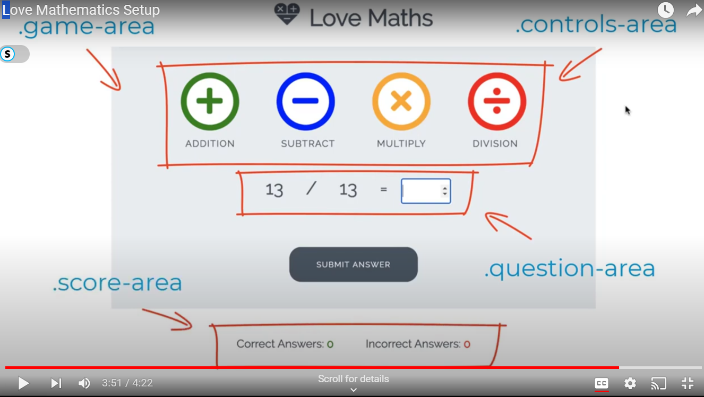
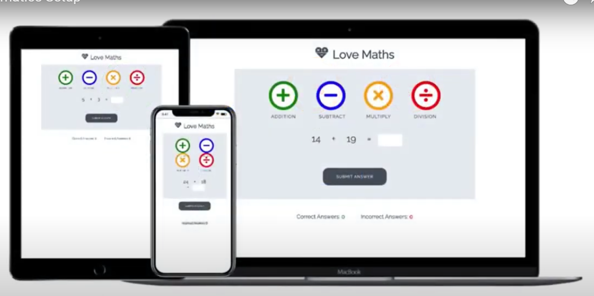

# Love-Maths

## Welcome to Love-Maths project for Code Institute Course work.

### Initialization

At the begining of the project, a repository was created and initialised with the Code Institutes template.

Using VS Code desktop, index.html was created with links to style.css, fontawesome fonts, google font 'Raleway' and Script.js files.

It was decided a link to Boot-Strap should also be included for its many benefits but mainly the ease of its grid system.

### Wire-Framing

It is important to visualize how the site should look from the begining, so an image was taken of the required wire-frame layout and worked on.

The Wire-Frame image sets out how the site should look when finished and sets zones by ID or Class so these parts can be targeted later.

At this point forward work on the site should take in to consideration a Mobile-First concept so it is imagined what the site will look like on different screen sizes.

### Documentation

It was decided early that work would start on the README.md file and be updated as processes were started and completed.

All code throughout the project should contain comments to explain each code snippets use this some aspects of this will add to the projects documentation later.

Other documentation may include git commits, Agile concepts such as Sprints, Userstories and iteration.

