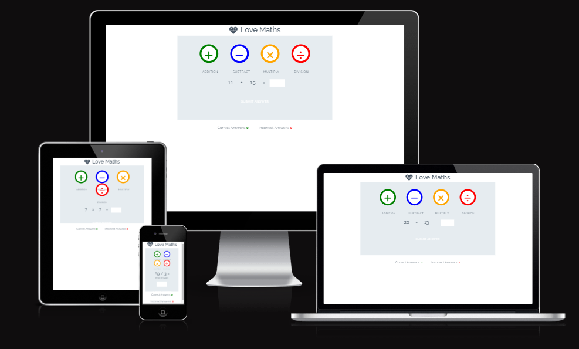
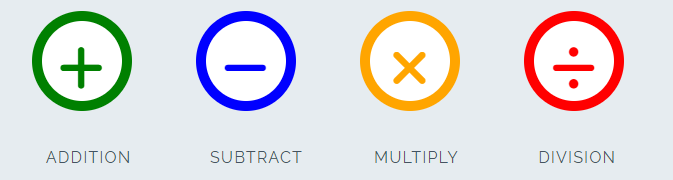
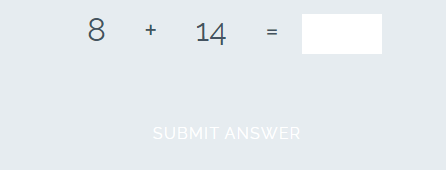
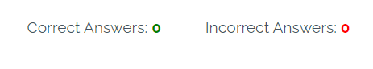

# Love-Maths

## Welcome to Love-Maths project for Code Institute Course work.

### Initialization

At the begining of the project, a repository was created and initialised with the Code Institutes template.

Using VS Code desktop, index.html was created with links to style.css, fontawesome fonts, google font 'Raleway' and Script.js files.

It was decided a link to Boot-Strap should also be included for its many benefits but mainly the ease of its grid system but it was never used.

### Wire-Framing

It is important to visualize how the site should look from the begining, so an image was taken of the required wire-frame layout and worked on.

The Wire-Frame image sets out how the site should look when finished and sets zones by ID or Class so these parts can be targeted later.

At this point forward work on the site should take in to consideration a Mobile-First concept so it is imagined what the site will look like on different screen sizes.

### Documentation

It was decided early that work would start on the README.md file and be updated as processes were started and completed.

All code throughout the project should contain comments to explain each code snippets use this some aspects of this will add to the projects documentation later.

Other documentation may include git commits, Agile concepts such as Sprints, Userstories and iteration.

### Responsive Design

Begining with mobile first methodology during the build it was found that the page content fit most screen sizes well only having a slight problem when in tablet view the game type buttons would over lap...

## Features 

Different parts of your project, what it is that they want to achieve and how your project is the best way to help them achieve these things.

### Existing Features

- __The Love Maths Logo and Heading__

  - Featured at the top of the page, the Love Maths logo and heading is easy to see for the user. Upon viewing the page, the user will be able to see the name of the game.

- __The Game Area__

  - This section will allow the user to play the maths game. The user will be able to easily see icons for addition,  subtraction, multiplication, and division games.
  - The user will be able to select the type of maths game they will be playing by clicking on the different icons. 

- __The Question section__

  - The question section is where the user will be able to see the elementary arithmetic question to answer as part of the game. The user will be able answer the questions in the answer box provide
  - The user will be able to submit their answer and a pop-up will make it known to the user if they answered correctly. 

- __The Score Area__

  - This section will allow the user to see exactly how many correct and incorrect answers they have provided. 

### Features Left to Implement

- calculator to check answers before submission.
- Bootstrap and flex-box to stop button over lay.

## Testing 

In this section, you need to convince the assessor that you have conducted enough testing to legitimately believe that the site works well. Essentially, in this part you will want to go over all of your project’s features and ensure that they all work as intended, with the project providing an easy and straightforward way for the users to achieve their goals.

In addition, you should mention in this section how your project looks and works on different browsers and screen sizes.

You should also mention in this section any interesting bugs or problems you discovered during your testing, even if you haven't addressed them yet.

If this section grows too long, you may want to split it off into a separate file and link to it from here.

### Validator Testing 

- HTML
    - No errors were returned when passing through the official [W3C validator](https://validator.w3.org/nu/?doc=https%3A%2F%2Fcode-institute-org.github.io%2Flove-maths%2F)
- CSS
    - No errors were found when passing through the official [(Jigsaw) validator](https://jigsaw.w3.org/css-validator/validator?uri=https%3A%2F%2Fvalidator.w3.org%2Fnu%2F%3Fdoc%3Dhttps%253A%252F%252Fcode-institute-org.github.io%252Flove-maths%252F&profile=css3svg&usermedium=all&warning=1&vextwarning=&lang=en)
- JavaScript
    - No errors were found when passing through the official [Jshint validator](https://jshint.com/)
      - The following metrics were returned: 
      - There are 11 functions in this file.
      - Function with the largest signature takes 2 arguments, while the median is 0.
      - Largest function has 10 statements in it, while the median is 3.
      - The most complex function has a cyclomatic complexity value of 4 while the median is 2.

### Unfixed Bugs

Working on implimenting bootstrap with this site to fix button over lay on screen sizes between tablet and laptop.

## Deployment

- The site was deployed to GitHub pages. The steps to deploy are as follows: 
  - In the GitHub repository, navigate to the Settings tab 
  - From the source section drop-down menu, select the Master Branch
  - Once the master branch has been selected, the page will be automatically refreshed with a detailed ribbon display to indicate the successful deployment. 

The live link can be found here - https://github.com/Damitwhy/Love-Maths

## Credits 

In this section you need to reference where you got your content, media and extra help from. It is common practice to use code from other repositories and tutorials, however, it is important to be very specific about these sources to avoid plagiarism. 

You can break the credits section up into Content and Media, depending on what you have included in your project. 

### Content 

- The text for the Home page was taken from Wikipedia Article A
- Instructions on how to implement form validation on the Sign Up page was taken from [Specific YouTube Tutorial](https://www.youtube.com/)
- The icons in the footer were taken from [Font Awesome](https://fontawesome.com/)

### Media

- The photos used on the home and sign up page are from This Open Source site
- The images used for the gallery page were taken from this other open source site

